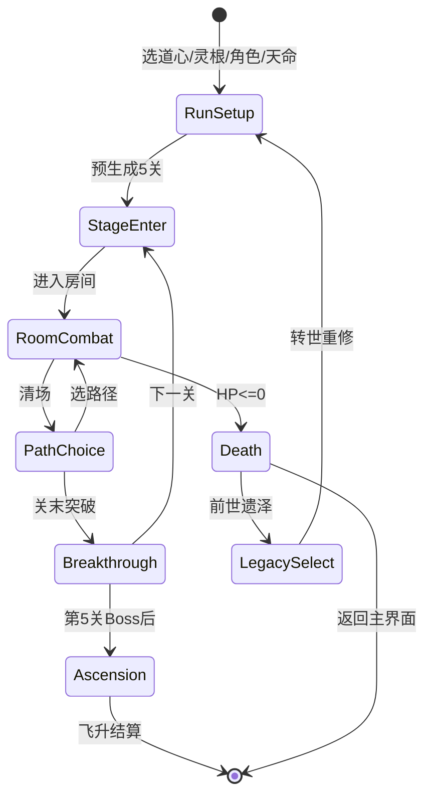
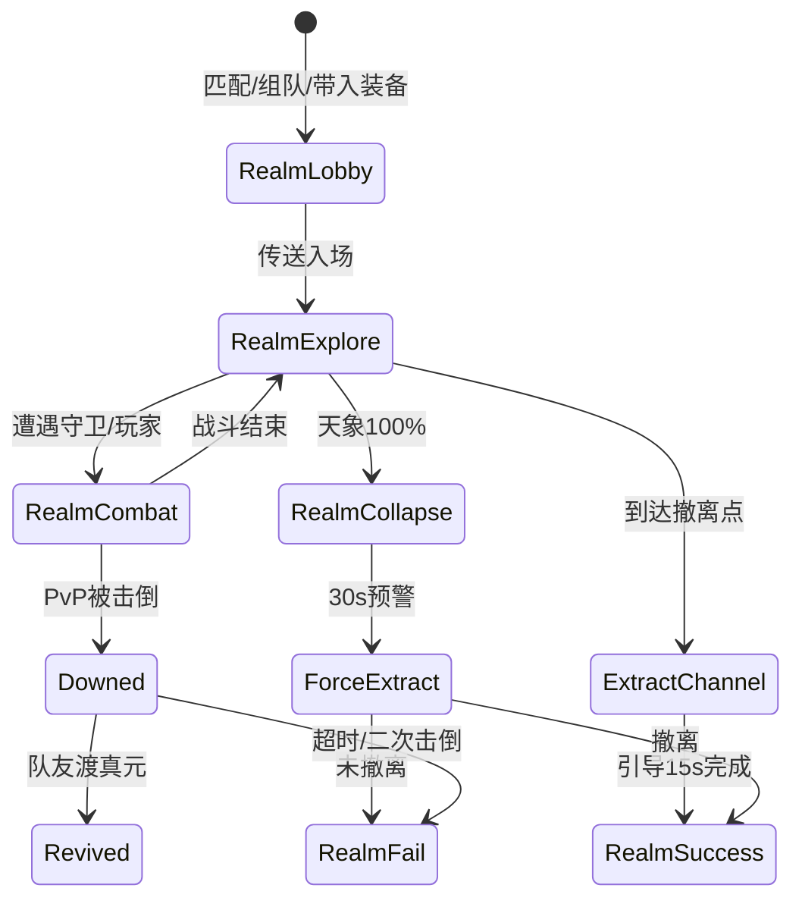

# 《轮回仙途》技术设计文档 (TDD)

**英文标题：** Samsara Ascension — Technical Design Document  
**对应 GDD：** `GDD_轮回仙途_v7.0.md`  
**版本：** v7.0.1  
**日期：** 2026-06-09  
**状态：** 预生产 — 设计转实现规格（覆盖度补全版）

---

## 目录

1. [文档目的与范围](#1-文档目的与范围)
2. [技术栈与平台目标](#2-技术栈与平台目标)
3. [总体架构](#3-总体架构)
4. [项目目录结构](#4-项目目录结构)
5. [核心运行时模块](#5-核心运行时模块)
6. [游戏模式与状态机](#6-游戏模式与状态机)
7. [战斗系统实现](#7-战斗系统实现)
8. [词条与构筑系统](#8-词条与构筑系统)
9. [天象与地形交互](#9-天象与地形交互)
10. [关卡与房间生成](#10-关卡与房间生成)
11. [上古秘境（网络与搜打撤）](#11-上古秘境网络与搜打撤)
12. [Meta 与持久化](#12-meta-与持久化)
13. [数据驱动架构](#13-数据驱动架构)
14. [UI 与反馈系统](#14-ui-与反馈系统)
15. [音频与 VFX 集成](#15-音频与-vfx-集成)
16. [性能、测试与工具链](#16-性能测试与工具链)
17. [开发阶段映射](#17-开发阶段映射)
18. [GDD 覆盖度分析](#18-gdd-覆盖度分析)
19. [角色与灵根系统](#19-角色与灵根系统)
20. [修炼境界与突破天赋](#20-修炼境界与突破天赋)
21. [难度与心魔试炼](#21-难度与心魔试炼)
22. [玩家操控与投射物](#22-玩家操控与投射物)
23. [灵宠系统](#23-灵宠系统)
24. [器灵系统](#24-器灵系统)
25. [丹药与法宝](#25-丹药与法宝)
26. [随机事件系统](#26-随机事件系统)
27. [因果系统](#27-因果系统)
28. [奖励关卡](#28-奖励关卡)
29. [Boss 行为框架](#29-boss-行为框架)
30. [无尽模式](#30-无尽模式)
31. [死亡结算与名场面](#31-死亡结算与名场面)
32. [局外成长与轮回殿](#32-局外成长与轮回殿)
33. [数值框架与平衡基线](#33-数值框架与平衡基线)
34. [渲染与美术技术规格](#34-渲染与美术技术规格)
35. [本地化、Steam 与存档迁移](#35-本地化steam-与存档迁移)
36. [附录：枚举与结构体参考](#36-附录枚举与结构体参考)
37. [附录：配置表索引](#37-附录配置表索引)
38. [附录：术语对照（代码 vs UI）](#38-附录术语对照代码-vs-ui)

---

## 1. 文档目的与范围

### 1.1 目的

本文档将 GDD v7.0 中的设计决策转化为可执行的工程规格，供程序、策划、美术协作实现。GDD 描述「做什么、为什么」；TDD 描述「怎么做、用什么结构」。

### 1.2 范围

| 包含 | 不包含 |
|------|--------|
| 系统架构、模块边界、接口契约 | 美术概念稿、叙事文案全文 |
| 伤害流水线、道韵衰减等核心算法 | 具体关卡手绘布局 |
| 三层数据架构与配表 Schema | 营销、Steam 页面文案 |
| 关卡/秘境生成流程 | 具体数值平衡迭代记录 |
| 网络同步策略（上古秘境） | 商业发行与运营计划 |
| Godot 4.x 推荐实现方案 | Unity 分支实现细节（可后续补充） |

### 1.3 v7.0 相对 v6.0 的技术增量

| 模块 | v7.0 新增/变更 |
|------|----------------|
| 游戏模式 | 新增「上古秘境」第三支柱（搜打撤 + PvPvE） |
| 战斗 | PvP 独立伤害流水线；韧性系统；伤害上限裁切 |
| 网络 | Listen Server / P2P 基础；专用服务器可选 |
| 多人 | 灵宠共鸣、队伍词条、传音轮盘、临时同盟 |
| 数据 | 秘境模板/节点/撤离/PvP/灵力波动/搜刮物配表 |
| 路线图 | Phase 6–8（合作 PvE、PvPvE、移动端） |

### 1.4 文档结构说明（v7.0.1）

- **§1–§17：** 初版 TDD 核心架构（战斗、关卡、秘境、数据层）
- **§18：** GDD 章节覆盖度审计矩阵
- **§19–§35：** v7.0.1 补全的缺失系统设计
- **§36–§38：** 附录（枚举、配表、术语）

---

## 2. 技术栈与平台目标

### 2.1 推荐技术选型

| 层级 | 选型 | 说明 |
|------|------|------|
| 引擎 | **Godot 4.x (2D)** | GDD 首选；俯视角/斜 45° 2D 渲染 |
| 语言 | GDScript + 少量 C#（可选热点） | 伤害流水线、配表编译可用 C# 优化 |
| 数据 | CSV → 运行时 Struct | 策划编辑 Excel 导出 CSV |
| 存档 | JSON + 用户目录 | `user://save/` |
| 网络 | Godot MultiplayerAPI | 上古秘境：Phase 6 起 P2P/Listen Server |
| 版本控制 | Git + LFS（音频/贴图） | 大资源走 LFS |
| 构建 | Godot Export + Steamworks SDK | PC Steam 首发 |

### 2.2 平台与性能目标

| 平台 | 目标帧率 | 分辨率 | 备注 |
|------|----------|--------|------|
| PC (Steam) | 60 FPS 稳定 | 1920×1080 基准 | Phase 1–5 优先 |
| PC 低配 | ≥ 30 FPS | 1280×720 | 粒子/弹幕 LOD |
| 移动端 | 30 FPS | 动态缩放 | Phase 8 可选 |

**同屏实体预算（PC）：** 敌人 ≤ 80、弹幕 ≤ 200、地形交互区 ≤ 12。

### 2.3 会话与规模

| 模式 | 单局时长 | 并发 |
|------|----------|------|
| 主线 | 15–30 min | 单人 |
| 无尽 | 无上限 | 单人 |
| 上古秘境 | 15–25 min | 2–3 队 × 1–4 人/队 |

---

## 3. 总体架构

### 3.1 分层架构

```
┌─────────────────────────────────────────────────────────────┐
│  Presentation Layer                                         │
│  HUD / 菜单 / 路径选择 / 词条三选一 / 秘境地图 UI            │
├─────────────────────────────────────────────────────────────┤
│  Game Flow Layer                                            │
│  RunManager / RealmManager / EndlessManager / SceneRouter   │
├─────────────────────────────────────────────────────────────┤
│  Simulation Layer                                           │
│  Combat / DamagePipeline / StatusFX / WeatherTerrain          │
│  AffixCompiler / PetSpirit / ArtifactSpirit / Karma          │
├─────────────────────────────────────────────────────────────┤
│  Generation Layer                                           │
│  StageGenerator / RoomLayout / RealmMapGen / LootTables      │
├─────────────────────────────────────────────────────────────┤
│  Data Layer                                                 │
│  ConfigLoader → EnumRegistry → CompiledRuntime (Cached)      │
├─────────────────────────────────────────────────────────────┤
│  Infrastructure                                             │
│  SaveSystem / AudioBus / VFXPool / NetSync / EventBus        │
└─────────────────────────────────────────────────────────────┘
```

### 3.2 通信模式

- **EventBus（信号/事件总线）：** 跨模块解耦。例：`damage_dealt`、`affix_acquired`、`weather_changed`、`player_downed`。
- **RunContext（单局上下文）：** 持有本局 seed、道心、灵根、角色、已选词条、因果标记、当前境界；各子系统只读或通过 RunManager 写入。
- **ConfigRegistry（全局只读）：** 启动时一次性编译配表，运行时禁止修改原始 Config。

### 3.3 确定性随机

所有局内随机 MUST 使用 **Seeded RNG**：

```gdscript
# 伪代码
var run_rng := RandomNumberGenerator.new()
run_rng.seed = hash_run_seed(player_choices, daily_seed_optional)

# 子系统派生子种子，保证可复现
func sub_rng(domain: String) -> RandomNumberGenerator:
    var r := RandomNumberGenerator.new()
    r.seed = hash(run_seed, domain)
    return r
```

用途：关卡预生成、词条权重、事件抽取、分享种子复现、每日挑战固定种子。

---

## 4. 项目目录结构

```
res://
├── autoload/                 # 单例
│   ├── EventBus.gd
│   ├── ConfigRegistry.gd
│   ├── SaveManager.gd
│   ├── AudioManager.gd
│   └── NetManager.gd         # Phase 6+
├── core/
│   ├── enums/                # TriggerType, EffectType, Element...
│   ├── structs/              # CompiledTag, DamageContext...
│   └── constants/
├── data/                     # CSV 配表（Git 跟踪）
│   ├── skills/
│   ├── affixes/
│   ├── pets/
│   ├── weather/
│   ├── events/
│   ├── dao_traditions/
│   ├── stages/
│   └── realm/                # 上古秘境
├── systems/
│   ├── combat/
│   ├── affix/
│   ├── weather/
│   ├── generation/
│   ├── pet/
│   ├── artifact_spirit/
│   ├── karma/
│   ├── meta/
│   └── network/
├── scenes/
│   ├── player/
│   ├── enemies/
│   ├── rooms/
│   ├── ui/
│   └── vfx/
├── assets/                   # 美术音频（LFS）
└── tools/                    # CSV 校验、配表导出脚本
```

---

## 5. 核心运行时模块

### 5.1 模块职责矩阵

| 模块 | 职责 | 关键输出 |
|------|------|----------|
| `RunManager` | 主线单局生命周期 | `RunState` |
| `EndlessManager` | 无尽层数、缩放、排行榜提交 | `EndlessState` |
| `RealmManager` | 秘境地图、搜刮、撤离、PvP 规则 | `RealmState` |
| `CombatSystem` | 命中检测、伤害请求、状态施加 | `DamageResult` |
| `DamagePipeline` | PvE/PvP 分轨计算 | `final_damage: float` |
| `AffixSystem` | 词条装备、触发器、Combo/道统检测 | `BuildSnapshot` |
| `SkillProgression` | 功法 5 层领悟进度 | `SkillLayerState` |
| `WeatherSystem` | 天象切换、地形元素生成 | `WeatherSnapshot` |
| `StageGenerator` | 五关骨架 + 房间填充 | `StagePlan[]` |
| `RoomSimulator` | 单房间战斗、波次、布局 | `RoomInstance` |
| `PetSystem` | 灵宠 AI、协同、成长、保底 | `PetState` |
| `ArtifactSpiritSystem` | 器灵觉醒、F 技能 | `SpiritState` |
| `KarmaSystem` | 因果标记、事件门控 | `KarmaLedger` |
| `MetaProgression` | 轮回点、轮回殿、仓库 | `ProfileSave` |
| `DestinySeedSystem` | 天命种子权重修正 | `WeightModifiers` |
| `DynamicDifficulty` | 构筑完成度隐性调节 | `DifficultyModifiers` |
| `CritMomentSystem` | 天机一击特写队列 | 慢动作/镜头事件 |

### 5.2 Autoload 初始化顺序

```
ConfigRegistry._ready()     # 加载并编译全部 CSV
SaveManager._ready()        # 读取 ProfileSave
AudioManager._ready()
EventBus (无依赖)
NetManager._ready()         # Phase 6+，读取网络配置
```

---

## 6. 游戏模式与状态机

### 6.1 顶层模式枚举

```gdscript
enum GameMode { MAIN_RUN, ENDLESS, ANCIENT_REALM }
enum DaoHeart { ASK_DAO, ENLIGHTEN, PROVE_DAO }  # 问道/悟道/证道
```

### 6.2 主线 Run 状态机



### 6.3 上古秘境状态机（Phase 6+）



### 6.4 房间类型枚举

```gdscript
enum RoomType {
    COMBAT, ELITE, SHOP, EVENT, REST, BOSS, HIDDEN
}
```

---

## 7. 战斗系统实现

### 7.1 实体组件模型（Godot）

推荐 **Composition** 而非深继承：

| 组件 | 节点/脚本 | 职责 |
|------|-----------|------|
| `HealthComponent` | 生命、护盾、死亡 | `take_damage()`, `heal()` |
| `MovementComponent` | WASD、速度、碰撞半径 12px | |
| `DodgeComponent` | 御风步：150px/0.25s i-frame，CD 可配置 | |
| `CombatComponent` | 普攻/法术/大招输入 | |
| `StatusComponent` | 灼烧/冰冻/麻痹等 | |
| `AffixHolder` | 已装备 CompiledTag 列表 | |
| `DefenseStats` | defense, pvp_tenacity | |

### 7.2 基础战斗参数（默认值）

| 参数 | 值 | 代码字段 |
|------|-----|----------|
| 移速 | 300 px/s | `move_speed` |
| 闪避距离 | 150 px | `dodge_distance` |
| 无敌帧 | 0.25 s | `dodge_iframe` |
| 闪避 CD | 1.0 s（问道 0.8） | `dodge_cooldown` |
| 碰撞半径 | 12 px | `collision_radius` |
| 默认生命/灵力/攻击/防御 | 100/100/10/5 | `base_stats` |
| 防御减伤 | `def / (def + 100)` | `calc_mitigation()` |

### 7.3 PvE 伤害流水线（10 步）

实现为纯函数 `DamagePipeline.compute_pve(ctx: DamageContext) -> DamageResult`：

| 阶段 | 名称 | 输入 | 输出 |
|------|------|------|------|
| 1 | 基础伤害 | skill/attack base | `base` |
| 2 | 属性加成 | element, spirit_root | `+flat%, +mult` |
| 3 | 词条加算 | CompiledTag flat effects | `additive` |
| 4 | 词条乘算 | 桶 A，道韵衰减 | `mult_a` |
| 5 | 环境乘算 | 桶 B：天象+地形 | `mult_b` |
| 6 | 伙伴乘算 | 桶 C：灵宠+器灵 | `mult_c` |
| 7 | 境界乘算 | 桶 D：天赋+局外 | `mult_d` |
| 8 | 暴击 | crit_rate, crit_mult | `×crit` |
| 9 | 防御减免 | target.defense | `after_mitigation` |
| 10 | 后处理 | 触发效果、天机一击、飘字 | `DamageResult` |

**公式：**

```
final = base
      × (1 + additive_bonus)
      × mult_a × mult_b × mult_c × mult_d
      × crit_mult
      × (1 - mitigation)
      × post_modifiers
```

### 7.4 道韵衰减（同桶递减）

```gdscript
const BUCKET_DECAY := [1.0, 0.8, 0.6]  # 第1/2/3+个乘算来源

func apply_bucket_multipliers(sources: Array[float]) -> float:
    sources.sort_custom(func(a, b): return a > b)  # 降序，大值优先100%
    var product := 1.0
    for i in sources.size():
        var mult := sources[i]
        var decay := BUCKET_DECAY[mini(i, BUCKET_DECAY.size() - 1)]
        var effective := 1.0 + (mult - 1.0) * decay
        product *= effective
    return product
```

桶分类（编译期写入 `CompiledTag.dao_bucket`）：

| 桶 | 来源示例 |
|----|----------|
| A | 纯阳真火、焚天、五行归元 |
| B | 烈日+干燥、灵雨+积水 |
| C | 灵宠被动、器灵加成 |
| D | 境界天赋、轮回殿永久加成 |

### 7.5 PvP 伤害流水线（秘境专用）

与 PvE **分轨实现**，禁止复用同一函数后打补丁：

| 步骤 | PvE | PvP |
|------|-----|-----|
| 词条乘算 | 道韵衰减 | × **0.6** 全局系数后再衰减 |
| 环境乘算 | 道韵衰减 | × **0.8** |
| 伙伴乘算 | 道韵衰减 | × **0.7** |
| 防御 | `def/(def+100)` | **PvP 韧性** `ten/(ten+200)` |
| 上限 | 无硬上限 | `min(dmg, target.max_hp × 0.15)` |

```gdscript
func calc_pvp_tenacity(realm_stage: String, realm_level: int) -> float:
    # 来自 realm_pvp.csv
    return base_tenacity + per_level * realm_level
```

### 7.6 状态效果

统一 `StatusEffect` 结构：`type`, `duration`, `stacks`, `tick_damage`, `source_id`。

| StatusType | 代码 | 可叠层 | 天象联动 |
|------------|------|--------|----------|
| BURN | burn | 是 | 烈日干燥爆燃 |
| FREEZE | freeze | 否 | 玄冰+积水→冰面 |
| PARALYZE | paralyze | 否 | 雷暴 |
| POISON | poison | 是 | 浓雾 |
| SLOW | slow | 否 | 灵雨 |
| KNOCKUP | knockup | — | — |
| SHIELD | shield | — | — |
| REGEN | regen | — | — |
| SUPPRESS | suppress | — | Boss 机制 |

### 7.7 Boss 阶段门控（防溢出）

```gdscript
func on_boss_health_threshold(boss, ratio: float):
    if ratio <= 0.5 and not boss.phase_gate_triggered:
        boss.phase_gate_triggered = true
        boss.set_invulnerable(3.0)
        boss.enter_phase(2)
```

天劫之灵：9 道独立 `SegmentHealth`，每段切换机制而非单一 HP 条。

---

## 8. 词条与构筑系统

### 8.1 词条类型与品质

```gdscript
enum AffixCategory { SKILL, SPELL, CONSTITUTION, DIVINE, SYNERGY, COMPANION }
enum Quality { COMMON, RARE, EPIC, LEGENDARY, DAO }  # 凡/灵/仙/天/道
enum Element { FIRE, WATER, THUNDER, WOOD, EARTH, CHAOS, HEAVEN, DUAL }
```

### 8.2 CompiledTag 运行时结构

```gdscript
class_name CompiledTag
var id: String
var category: AffixCategory
var quality: Quality
var element: Element
var dao_bucket: int           # 0=none, 1-4=A-D
var triggers: Array[CompiledTrigger]
var flat_modifiers: Dictionary  # StatType -> float
var mult_modifiers: Dictionary
var tags: PackedStringArray   # 用于 Combo/道统条件匹配
```

### 8.3 触发器编译

配表 `effect1`, `effect2` 列编译为：

```gdscript
class_name CompiledTrigger
var trigger: TriggerType      # ON_HIT, ON_KILL, ON_CRIT, EVERY_N_HITS...
var effect: EffectType        # APPLY_STATUS, MULT_DAMAGE, SPAWN_PROJECTILE...
var params: Dictionary        # 类型安全解析后的参数
var conditions: Array[Condition]
```

**原则：** 运行时只执行 CompiledTrigger，禁止 `match affix_id` 硬编码。

### 8.4 词条选择（三选一）

```gdscript
func roll_affix_offers(room_type: RoomType, run_ctx: RunContext) -> Array[CompiledTag]:
    var weights := AFFIX_ROLL_TABLE[room_type].duplicate()
    weights = DestinySeedSystem.apply(weights, run_ctx.destiny_seed)
    weights = apply_element_bias(run_ctx.recent_element_picks)  # 连续3同属性+20%
    return weighted_sample_without_replace(weights, offer_count(run_ctx.character))
```

| 房间 | 凡 | 灵 | 仙 | 天 |
|------|----|----|----|-----|
| 普通 | 70% | 25% | 5% | 0% |
| 精英 | 40% | 40% | 15% | 5% |
| Boss | 0% | 70% | 20% | 10% |

### 8.5 功法 5 层领悟

```gdscript
class_name SkillProgress
var skill_id: String
var current_layer: int        # 1-5
var progress: float           # 0.0-1.0
var unlock_type: UnlockType   # HIT_COUNT, KILL_STATUS, MULTI_KILL, WEATHER_BOSS
var unlock_counter: int
```

进度来源由 `skills.csv` 的 `unlock_type` / `unlock_value` 驱动；Layer 4–5 条件在 GDD 9.2 定义。

### 8.6 Build 可视化数据接口

| UI 面板 | 数据源 |
|---------|--------|
| 功法迷你条 | `SkillProgress[]` |
| Combo 指示器 | `ComboGraph.evaluate(owned_tags)` |
| 道统进度 | `DaoTraditionRegistry.check(all_tags, run_ctx)` |
| 实力评估 | `BuildAnalyzer.estimate_dps(run_ctx)` |
| 道韵衰减条 | `DamagePipeline.preview_bucket_fill(run_ctx)` |

### 8.7 道统觉醒

- 条件：`dao_traditions.csv` → `conditions` 表达式（词条 ID + 标签 + 上下文）
- 限制：**每局最多 1 次** awakening；写入 `RunState.dao_tradition_awakened`
- 觉醒时：`EventBus.dao_tradition_awakened` → CritMomentSystem 演出

---

## 9. 天象与地形交互

### 9.1 WeatherSystem 职责

1. 按关卡/层/秘境时间表切换 `WeatherId`
2. 在房间布局中放置 `TerrainElement` 节点（池化复用）
3. 广播 `weather_changed` / `terrain_interaction_first_time`

### 9.2 天象数据结构

```gdscript
class_name WeatherConfig  # 来自 weather.csv
var id: String
var weight: float
var element_mods: Dictionary  # Element -> float
var terrain_type: TerrainType
var terrain_effect: String    # 编译为 TerrainBehavior
```

### 9.3 地形交互执行

```gdscript
class_name TerrainElement
var terrain_type: TerrainType  # DRY, WATER, ICE, FOG, ARC...
var radius: float
var position: Vector2

func on_projectile_hit(projectile: Projectile):
    var interaction := InteractionRegistry.resolve(
        weather.current, terrain_type, projectile.element
    )
    if interaction:
        interaction.execute(self, projectile)
```

**首次交互：** 写入 `ProfileSave.discovered_interactions`；触发慢动作 0.3s + UI「领悟！XXX」（GDD 8.5）。

### 9.4 天象节奏

| 上下文 | 切换触发 |
|--------|----------|
| 主线 | 每关预分配；关内按房间推进可选加速 |
| 无尽 | 每层随机；51+ 层混沌天象（多天气叠加） |
| 秘境 | **时间驱动** 5 min/级恶化，非房间驱动 |

---

## 10. 关卡与房间生成

### 10.1 预生成流程（主线）

```gdscript
func generate_full_run(seed: int, profile: ProfileSave) -> RunPlan:
    var plan := RunPlan.new()
    plan.seed = seed
    for stage_id in STAGE_ORDER:
        var skeleton := load_stage_skeleton(stage_id)  # stages.csv
        var slots := roll_room_types(skeleton, plan.rng)
        slots = enforce_anti_streak_rules(slots)
        var weather := assign_weather(stage_id, plan.rng)
        for slot in slots:
            var room := RoomPlan.new()
            room.layout = generate_layout(slot, weather, stage_id)
            room.enemies = roll_enemy_waves(slot, stage_id)
            room.loot = roll_loot(slot)
            if slot.type == EVENT:
                room.event_id = roll_event(plan.rng, weather, karma)
            plan.rooms.append(room)
    plan.hidden_rooms = roll_hidden_rooms(plan)
    return plan
```

### 10.2 防连续规则（示例）

- 禁止连续 3 个 `COMBAT`
- 精英房后下一槽非精英
- 每关至少 1 精英 + 1 事件或坊市

### 10.3 房间布局约束校验

生成后 MUST 通过 `LayoutValidator`：

```gdscript
func validate(layout: RoomLayout) -> bool:
    return layout.has_min_paths(width >= 60, count >= 2) \
        and layout.max_distance_to_safe_point <= 150 \
        and layout.large_obstacle_count <= 2
```

失败则 **同一 slot 重 roll**（最多 8 次，否则 fallback 模板）。

### 10.4 房间尺寸（像素）

| 关卡 | 宽 × 高 |
|------|---------|
| 1 | 600 × 400 |
| 2 | 700 × 450 |
| 3 | 800 × 500 |
| 4 | 850 × 550 |
| 5 | 900 × 600 |
| 秘境 | 900 × 600（统一大房） |

### 10.5 敌人缩放

```gdscript
func stage_enemy_scale(stage: int) -> Vector2:  # hp_mult, atk_mult
    return STAGE_SCALE_TABLE[stage]  # GDD 14.6
```

---

## 11. 上古秘境（网络与搜打撤）

### 11.1 架构选型

| Phase | 方案 | 适用 |
|-------|------|------|
| Phase 6 | Godot **Listen Server** + ENet | 2–4 人合作 PvE |
| Phase 7 | 增强 Listen Server 或 **专用服务器** | 2–3 队 PvPvE |
| 备选 | WebRTC P2P | NAT 友好场景 |

**权威模型：**

| 数据 | 权威方 |
|------|--------|
| 玩家位置/输入 | 各客户端预测 + 主机校正 |
| 伤害结算 | **主机/server** |
| 搜刮物生成 | 主机（seed 同步） |
| 撤离进度 | 主机 |
| 天象恶化时钟 | 主机 |

### 11.2 网络同步最小集

```gdscript
# 主机广播
@rpc("authority", "call_local", "reliable")
func sync_realm_state(state: RealmStateSnapshot): ...

@rpc("any_peer", "call_remote", "unreliable")
func submit_input(input_frame: InputFrame): ...

@rpc("authority", "call_local", "reliable")
func apply_pvp_damage(attacker_id: int, target_id: int, result: DamageResult): ...
```

### 11.3 秘境地图生成

```gdscript
func generate_realm_map(template: RealmTemplate, team_count: int) -> RealmGraph:
    # 15-25 节点有向无环图
    var graph := build_dag(template.node_count, realm_rng)
    assign_fixed_nodes(graph, [BOSS, EXTRACT×3, TREASURE×2-3, SPRING×2-3])
    scatter_spawns(graph, team_count, min_distance=3)
    apply_fog_of_war(graph)
    return graph
```

### 11.4 搜刮与背包

```gdscript
class_name LootInventory
const MAX_ITEMS := 20  # 纳物袋

func add_loot(item: LootItem) -> bool:
    if items.size() >= MAX_ITEMS: return false
    items.append(item)
    return true
```

搜刮交互：G 键；时长 1–5s（GDD 20.2.2）；可被打断。

### 11.5 灵力波动（SpiritPulse）

```gdscript
func emit_pulse(source: Node2D, pulse_type: PulseType):
    var cfg := PULSE_TABLE[pulse_type]  # range, duration, attract
    EventBus.spirit_pulse.emit(source.global_position, cfg)
    if cfg.attract_enemies:
        guard_ai.attract_to(source.global_position)
    if is_mass_pvp(combatants) >= 4:
        WeatherSystem.accelerate_collapse(1.5, 120.0)
```

### 11.6 PvP 击倒与救援

| 状态 | 时长 | 规则 |
|------|------|------|
| 真元涣散 | 10s 倒计时 | 显示可救援圈 |
| 渡真元 | 3s 引导 | 双方定身 |
| 出局 | — | 丢失 60% 搜刮物；每人每局 1 次救援 |
| 二次击倒 | — | 直接出局 |

### 11.7 撤离点周期

```gdscript
const EXTRACT_CYCLE := {"closed": 120, "open": 60}  # 秒

func update_extract_points(dt: float):
    cycle_timer -= dt
    if collapse_progress >= 1.0:
        force_all_extracts_open = true  # 最后30s全图高亮
```

### 11.8 匹配（Phase 6+）

- 房间码邀请
- 快速匹配（道心/模式筛选）
- 好友列表（Steam API）
- **PvE Only** 开关：无 PvP 伤害、无对峙；掉落率 ×0.8

### 11.9 传音、同盟与赛季（Phase 7）

**传音轮盘 `WhisperWheel`：**

```gdscript
class_name WhisperWheel
const COOLDOWN := 10.0
func send(preset_id: String, sender_team: int):
    # whisper_wheel.csv → 文案 key + karma_side_effects
    NetManager.rpc_show_whisper(sender_team, preset_id)
```

预设 6 条；「联手」+ 对方接受 → `AllianceSystem.propose()`。

**临时同盟 `AllianceSystem`：**

```gdscript
class_name Alliance
var teams: Array[int]
var expires_at: float          # 5 分钟或 Boss 战结束
var shared_vision: bool = true
var pvp_disabled: bool = true
```

**赛季 `SeasonService`：**

- 周期 30 天；`season_config.csv` 轮换秘境天命种子
- 六维排行榜写入 Steam / 本地；奖励通过 `MetaProgression.grant_season_reward(tier)`

### 11.10 防作弊（Phase 7 最低要求）

- 服务端/主机验证：伤害结果、搜刮物添加、撤离完成
- 客户端仅发送输入与请求
- 异常 DPS/移速阈值检测 → 踢出

---

## 12. Meta 与持久化

### 12.1 ProfileSave 结构

```gdscript
class_name ProfileSave
var reincarnation_points: int
var unlocked_spirit_roots: PackedStringArray
var unlocked_characters: PackedStringArray
var reincarnation_hall_upgrades: Dictionary
var destiny_seeds_discovered: PackedStringArray
var character_fragments: Dictionary      # char_id -> bitmask 6
var dao_tradition_stats: Dictionary
var endless_high_score: int
var realm_best_rank: int
var out_of_run_warehouse: Array[WarehouseItem]  # 秘境带入
var settings: PlayerSettings
```

### 12.2 前世遗泽

- 触发：`RunManager.on_player_death`
- 生成：分析 `BuildSnapshot` 主题 → 方向性 buff（非具体词条）
- 限制：**叠加不超过 1 层**；每局 3–4 选项

### 12.3 动态难度（隐性）

```gdscript
func evaluate_build_score(run_ctx: RunContext) -> float:
    # 词条数量、品质、combo 完成度、功法层数加权 → 0-100

func apply_dynamic_difficulty(score: float, dao_heart: DaoHeart) -> DifficultyModifiers:
    if score > 80: return bump_enemy_hp(0.05)  # 证道±3%, 问道±10%
    if score < 40: return bump_enemy_hp(-0.05)
    return DifficultyModifiers.identity()
```

**禁止** 调节掉落品质。

### 12.4 天命种子

```gdscript
class_name DestinySeed
var id: String
var affix_weight_mods: Dictionary
var weather_weight_mods: Dictionary
var event_weight_mods: Dictionary
var reveal_title: String      # 开局展示
var reveal_summary: String    # 部分揭示；混沌/深渊不揭示细节
```

---

## 13. 数据驱动架构

### 13.1 三层架构

```
CSV/Excel (策划)
    ↓ ConfigLoader.parse()
Enum Layer (编译期类型安全)
    ↓ AffixCompiler.compile()
Runtime Struct (CompiledTag, CompiledEvent, ...)
    ↓ 游戏运行时只读访问
```

### 13.2 加载流程

```gdscript
# ConfigRegistry._ready()
for csv_path in DATA_MANIFEST:
    var rows := CSVParser.load(csv_path)
    validate_schema(rows, SCHEMAS[csv_path])  # tools/ 校验脚本
    register_raw(csv_path, rows)
compile_all()  # 生成 Compiled* 并建立索引
```

### 13.3 配表清单

| 文件 | 用途 | GDD 章节 |
|------|------|----------|
| `skills.csv` | 功法 5 层 | 29.2 |
| `affixes.csv` | 全部词条 | 31 |
| `pets.csv` | 灵宠 | 29.3 |
| `weather.csv` | 天象 | 29.4 |
| `events.csv` | 事件 | 29.5, 32 |
| `dao_traditions.csv` | 道统 | 29.6 |
| `stages.csv` | 关卡骨架 | 29.7 |
| `enemies.csv` | 敌人/Boss | 14.6, 18 |
| `pills.csv` / `artifacts.csv` | 丹药法宝 | 11 |
| `realm_templates.csv` | 秘境模板 | 20.13 |
| `realm_nodes.csv` | 秘境节点 | 20.13 |
| `extract_points.csv` | 撤离点 | 20.13 |
| `realm_pvp.csv` | PvP 参数 | 20.13 |
| `spirit_pulse.csv` | 灵力波动 | 20.13 |
| `realm_loot.csv` | 搜刮物 | 20.13 |
| `karma_events.csv` | 因果门控 | 16 |
| `meta_upgrades.csv` | 轮回殿 | 22 |
| `destiny_seeds.csv` | 天命种子 | 23 |
| `characters.csv` | 角色定义 | 19 |
| `spirit_roots.csv` | 灵根 | 19 |
| `character_fragments.csv` | 碎片叙事 | 19 |
| `breakthrough_talents.csv` | 突破天赋 | 20 |
| `pet_synergies.csv` | 灵宠协同 | 23 |
| `pet_weather_mods.csv` | 灵宠天象 | 23 |
| `pet_resonance.csv` | 灵宠共鸣 | 23 |
| `artifact_spirits.csv` | 器灵 | 24 |
| `spirit_awaken.csv` | 觉醒条件 | 24 |
| `spirit_skills.csv` | 器灵 F 技能 | 24 |
| `bosses.csv` | Boss 阶段 | 29 |
| `bonus_stages.csv` | 奖励关 | 28 |
| `karma_events.csv` | 因果事件 | 27 |
| `realm_karma.csv` | 秘境因果行为 | 27 |
| `meta_points.csv` | 轮回点公式 | 32 |
| `unlocks.csv` / `privileges.csv` | 轮回殿 | 32 |
| `stage_themes.csv` | 关卡视觉主题 | 34 |
| `projectiles.csv` | 弹道参数 | 22 |
| `shop_tables.csv` | 坊市商品 | 25 |
| `whisper_wheel.csv` | 传音轮盘 | 11 |
| `team_affixes.csv` | 队伍词条 | 11 |
| `daily_challenges.csv` | 每日试炼 | 30 |
| `season_config.csv` | 秘境赛季 | 11 |

### 13.4 Schema 示例

**skills.csv**

| 列 | 类型 | 说明 |
|----|------|------|
| skill_id | string | 主键 |
| layer | int | 1–5 |
| name | string | 显示名 |
| unlock_type | enum | UnlockType |
| unlock_value | int | 阈值 |
| effect1, effect2 | string | 效果 DSL |

**affixes.csv**

| 列 | 类型 | 说明 |
|----|------|------|
| id | string | F001 |
| name | string | |
| category | enum | AffixCategory |
| element | enum | Element |
| quality | enum | Quality |
| dao_bucket | int | 0–4 |
| effect1..n | string | 效果 DSL |
| combo_tags | string[] | Combo/道统匹配 |

**dao_traditions.csv**

| 列 | 类型 |
|----|------|
| dao_tong_id | string |
| name | string |
| type | general/char/realm |
| conditions | expression |
| effect | string |
| title | string |
| visual | string |

### 13.5 效果 DSL（建议语法）

```
# 示例
mult_fire_damage:1.3          # 桶A乘算 +30%火伤
apply_status:burn:3:0.1       # 10%概率灼烧3秒
on_kill:heal_pct:0.02         # 击杀回2%生命
require_weather:thunder       # 条件
```

编译器将 DSL 解析为 `CompiledTrigger`；**新增词条只需改 CSV**。

---

## 14. UI 与反馈系统

### 14.1 UI 场景分层

| 层级 | z-index | 内容 |
|------|---------|------|
| World | 0 | 游戏世界 |
| HUD | 10 | 血条、功法条、Combo |
| Overlay | 20 | 路径选择、词条三选一 |
| CritMoment | 30 | 天机一击慢动作层 |
| Modal | 40 | 暂停、设置 |
| Network | 50 | 传音、遭遇提示 |

### 14.2 输入映射

统一 `InputMap` 资源，与 GDD 4.1 一致。秘境额外：`interact(G)`, `whisper(T)`, `inventory(I)`。

### 14.3 天机一击 CritMomentSystem

```gdscript
class_name CritMomentSystem
var queue: Array[CritMomentRequest]

func request(moment: CritMomentType, priority: int):
    # 连击特写不叠加：高优先级替换低优先级
    queue.push_back(CritMomentRequest.new(moment, priority))
```

| 类型 | 可跳过 | 最长时间 |
|------|--------|----------|
| ELITE_KILL | 是 | 0.3s |
| COMBO_50/100/200 | 是 | 0.2–0.5s |
| BOSS_KILL | **否** | 0.5s |
| DAO_TRADITION | **否** | 0.5s+ |
| PVP_PLUNDER | 是 | 0.3s |

实现：`Engine.time_scale` 调整 + 相机 zoom + UI 动画；**不用** 全屏 pause 树（除道统/Boss 指定帧）。

### 14.4 秘境专属 UI 数据绑定

| 组件 | 绑定 |
|------|------|
| 恶化进度条 | `RealmState.collapse_progress` |
| 灵力波纹 | `EventBus.spirit_pulse` |
| 搜刮计数 | `LootInventory.count` / 20 |
| 地图迷雾 | `RealmGraph.explored` |
| 遭遇条 | `RealmManager.nearby_teams` |

---

## 15. 音频与 VFX 集成

### 15.1 AudioBus 布局

```
Master
├── BGM
├── SFX_Combat
├── SFX_UI
├── SFX_Weather
├── SFX_Pet_Spirit
└── SFX_Realm          # Phase 6+
```

### 15.2 关键触发

| 事件 | BGM | SFX |
|------|-----|-----|
| Boss 战 | crossfade → boss | — |
| 天象切换 | — | weather_stinger |
| 道统觉醒 | duck -6dB | dao_bell + element |
| 秘境崩塌 | realm_collapse | 每 5s 钟声 |
| 撤离引导 | heartbeat_layer | 渐强 15s |

### 15.3 VFX 对象池

`VFXPool` 预实例化：命中火花、/status 图标、地形交互（爆燃/导电/结冰）、灵气爆发。

---

## 16. 性能、测试与工具链

### 16.1 性能策略

- 弹幕：`MultiMeshInstance2D` 或 GPU 粒子
- 敌人 AI：分帧 tick（每 2 帧更新 distant AI）
- 配表：启动时编译，运行时零 CSV IO
- 秘境网络：状态快照 10–20 Hz；输入 30 Hz

### 16.2 自动化测试

| 测试类型 | 工具 | 覆盖 |
|----------|------|------|
| 单元 | GUT / Godot 4 test | DamagePipeline, 道韵衰减, LayoutValidator |
| 配表 | `tools/validate_csv.gd` | CI 校验 Schema + 引用完整性 |
| 确定性 | seed 回归 | 同一 seed 生成相同 StagePlan |
| 网络 | 本地多实例 | 撤离、击倒、救援同步 |

### 16.3 推荐 CI 步骤

```
1. tools/validate_csv.gd
2. gut -gtest=res://tests/unit/
3. godot --headless --script res://tests/determinism/run_regression.gd
```

### 16.4 调试工具

- **Seed 控制台：** 强制 run seed / 跳转房间
- **Build Inspector：** 实时 DPS 预估、桶填充
- **God Mode / 一键飞升：** 仅 dev build

---

## 17. 开发阶段映射

| Phase | 周数 | 技术交付物 | TDD 章节 |
|-------|------|------------|----------|
| 1 核心战斗 | 2 | Player+Enemy+HUD+CritMoment 原型 | §7, §14.3, §22 |
| 2 词条 | 3 | AffixCompiler+DamagePipeline+30 词条 | §8, §13 |
| 3 完整一局 | 5 | StageGenerator+Weather+Pet 原型 | §9, §10, §23 |
| 4 深度内容 | 6 | 全角色/灵根/器灵/道统/Meta | §19–§24, §8.7, §32 |
| 5 无尽+打磨 | 6 | EndlessManager+排行榜+Demo | §30, §35.2, §16 |
| 6 秘境 PvE | 8 | NetManager+RealmGen+Extract | §11, §23.6, §27.3 |
| 7 秘境 PvPvE | 6 | PvP 管线+Pulse+反作弊 | §7.5, §11, §27.3 |
| 8 移动端 | 4 | 触屏 InputMap+UI 缩放 | §22, §34, §14.2 |

**单人可发布：** Phase 1–5（约 22 周）  
**完整含 PvPvE：** Phase 1–7（约 36 周）

---

## 18. GDD 覆盖度分析

### 18.1 覆盖度矩阵

| GDD 章 | 主题 | v7.0 覆盖 | v7.0.1 覆盖 | TDD 章节 |
|--------|------|-----------|-------------|----------|
| 1 | 游戏概述 | 部分 | 完整 | §2, §6 |
| 2 | 设计哲学 | 缺失 | 部分 | §18.2（工程约束） |
| 3 | 难度系统 | 部分 | 完整 | §21 |
| 4 | 基础操作 | 部分 | 完整 | §7.2, §22 |
| 5 | 角色与灵根 | 缺失 | 完整 | §19 |
| 6 | 修炼境界 | 部分 | 完整 | §20 |
| 7 | 战斗系统 | 完整 | 完整 | §7 |
| 8 | 天象地形 | 完整 | 完整 | §9 |
| 9 | 功法词条 | 完整 | 完整 | §8 |
| 10 | Build 可视化 | 部分 | 完整 | §8.6, §14 |
| 11 | 丹药法宝 | 缺失 | 完整 | §25 |
| 12 | 灵宠 | 缺失 | 完整 | §23 |
| 13 | 器灵 | 缺失 | 完整 | §24 |
| 14 | 关卡房间 | 完整 | 完整 | §10 |
| 15 | 随机事件 | 缺失 | 完整 | §26 |
| 16 | 因果 | 缺失 | 完整 | §27 |
| 17 | 奖励关卡 | 缺失 | 完整 | §28 |
| 18 | Boss | 部分 | 完整 | §29 |
| 19 | 无尽模式 | 缺失 | 完整 | §30 |
| 20 | 上古秘境 | 完整 | 完整 | §11 + §23.6, §27.3 |
| 21 | 失败重生 | 部分 | 完整 | §31 |
| 22 | 局外成长 | 部分 | 完整 | §32 |
| 23 | 天命种子 | 部分 | 完整 | §12.4 |
| 24 | 动态难度 | 部分 | 完整 | §12.3 |
| 25 | UI/UX | 部分 | 完整 | §14, §34 |
| 26 | 美术 | 缺失 | 完整 | §34 |
| 27 | 音频 | 部分 | 完整 | §15 |
| 28 | 数值框架 | 缺失 | 完整 | §33 |
| 29 | 数据架构 | 完整 | 完整 | §13 |
| 30 | 开发路线 | 完整 | 完整 | §17 |
| 31–33 | 附录表 | 引用 | 引用 | §37 |

**初版覆盖率（按 GDD 主章节计）：** 约 45% 完整、30% 部分、25% 缺失  
**v7.0.1 目标覆盖率：** ≥ 95% 完整（设计哲学/营销类仍有意省略）

### 18.2 设计原则 → 工程约束映射

GDD 七项设计原则在代码层的强制约束：

| GDD 原则 | 工程约束 |
|----------|----------|
| 选择大于运气 | 所有随机奖励 MUST 经 `OfferSelector` 提供 2–4 个可选项；禁止无选择直给 |
| 发现大于告知 | Combo/因果结果首次隐藏；`ProfileSave.discovered_*` 控制 UI 剧透 |
| 节奏大于强度 | `StageGenerator` 骨架强制 REST/SHOP 槽；Boss 前必有调息房 |
| 死亡是进度 | 死亡流程 MUST 经过 `DeathSummary` + `LegacySelector`；禁止空结算 |
| 修仙即 Roguelite | 境界/词条槽/天象/因果共用 `RunContext`，禁止平行不一致状态 |
| 伙伴是战友 | 灵宠/器灵 MUST 有独立组件与协同输入；禁止纯数值 Buff 替代 |
| 博弈层（v7.0） | 秘境搜刮/撤离/灵力波动为独立子系统，禁止与主线房间逻辑混写 |

### 18.3 仍有意不包含的内容

- 具体叙事文案、碎片全文、Steam 商店描述
- 单次数值平衡调参记录
- Unity 分支实现
- 商业运营与赛季活动文案

---

## 19. 角色与灵根系统

### 19.1 CharacterSystem 架构

```gdscript
class_name CharacterDefinition  # characters.csv
var id: String
var unlock_condition: UnlockCondition
var unique_mechanic: MechanicType   # SWORD_INTENT, RAGE, PILL_HEART, TALISMAN, DEMONIZE, WANDERER
var passive_modifiers: Dictionary
var realm_affix_rules: Dictionary   # 散修+1选项等
```

运行时由 `CharacterController` 挂载在 Player 上，与 `CombatComponent` 并列。

### 19.2 灵根（SpiritRootSystem）

```gdscript
class_name SpiritRootConfig  # spirit_roots.csv
var id: String
var unlock_requirement: String
var element_damage_bonus: Dictionary   # Element -> float
var element_affix_bonus: Dictionary
var on_hit_proc: CompiledTrigger       # 如火灵根 10% 灼烧
var pet_affinity: Dictionary           # pet_id -> bonus
```

**应用顺序：** 基础属性 → 灵根 flat → 灵根 on_hit（战斗流水线阶段 2）。

| 灵根 id | 代码枚举 | 解锁 |
|---------|----------|------|
| fire | SPIRIT_FIRE | 默认 |
| water | SPIRIT_WATER | 默认 |
| thunder | SPIRIT_THUNDER | 默认 |
| wood | SPIRIT_WOOD | 默认 |
| earth | SPIRIT_EARTH | 默认 |
| chaos | SPIRIT_CHAOS | 默认 |
| heaven | SPIRIT_HEAVEN | 飞升 1 次 |
| dual | SPIRIT_DUAL | 2000 轮回点 |
| chaos_body | SPIRIT_CHAOS_BODY | 飞升 3 次 |

### 19.3 角色独特机制实现

统一 `UniqueMechanicComponent` 接口：

```gdscript
class_name UniqueMechanicComponent
func on_attack_hit(ctx: DamageContext): pass
func on_take_damage(amount: float): pass
func on_kill(enemy: Node): pass
func on_room_enter(room: RoomInstance): pass
func get_ui_meter() -> MeterSnapshot      # 剑意/怒气/入魔等 0-100
func try_activate_ultimate() -> bool      # R 键联动
```

| 角色 | MechanicType | 核心状态 | R 键/自动触发 |
|------|--------------|----------|---------------|
| 散修 | WANDERER | `rooms_since_affix: int` | 每 3 新房间 +1 低阶词条 |
| 剑修 | SWORD_INTENT | `sword_intent: 0-100` | 满值→剑意领域 5s |
| 体修 | RAGE | `rage: 0-100` | 满值→霸体 6s + 震波 |
| 丹修 | PILL_HEART | `distinct_pill_types: Set` | 被动：2 种以上丹药 +20% |
| 符修 | TALISMAN | `arrays: Array[TalismanArray]` | 每 20s 放置符阵，最多 3 |
| 魔修 | DEMONIZE | `demon: 0-100` | 满值→入魔 15s |

**符阵：** `TalismanArray` 为 Area2D + 触发器；踩踏敌人/灵宠经过分别触发；与天象联动走 `InteractionRegistry`。

### 19.4 角色碎片叙事

```gdscript
class_name FragmentSystem
func check_unlock(fragment_id: String, profile: ProfileSave, run: RunState) -> bool
func on_unlock(fragment_id: String):  # 非阻塞 toast，不打断战斗
    SaveManager.unlock_fragment(...)
    if all_six_unlocked(character_id):
        EventBus.character_endings_unlocked.emit(character_id)
```

解锁条件来自 `character_fragments.csv`；与道统终极飞升联动见 §8.7。

### 19.5 角色解锁追踪

`ProfileSave.lifetime_stats` 持久化：击杀数、承受伤害、丹药使用、天象交互次数、恶行因果数等，供 `UnlockConditionEvaluator` 判定。

---

## 20. 修炼境界与突破天赋

### 20.1 境界与词条槽

| 境界 stage | `realm_level` | 词条槽 | 对应大关 |
|------------|---------------|--------|----------|
| 炼气 | 1 | 3→5（关内突破） | 第 1 关 |
| 筑基 | 2 | 5→7 | 第 2 关 |
| 金丹 | 3 | 7→9 | 第 3 关 |
| 元婴 | 4 | 9→12 | 第 4 关 |
| 渡劫 | 5 | 12 | 第 5 关 |

```gdscript
func affix_slots_at_realm(level: int, breakthrough_done: bool) -> int:
    return REALM_SLOT_TABLE[level].after if breakthrough_done else REALM_SLOT_TABLE[level].before
```

**秘境模式：** 词条槽 = 局外已解锁最大槽（`ProfileSave.max_affix_slots`），不在局内突破。

### 20.2 BreakthroughSystem

关末 Boss 后进入 `BreakthroughState`：

1. 播放突破演出（可跳过）
2. `TalentSelector` 从 `breakthrough_talents.csv` 按境界抽 3 选 1
3. 写入 `RunState.realm_talents: Array[String]`
4. 扩展词条槽

```gdscript
class_name BreakthroughTalent  # breakthrough_talents.csv
var id: String
var realm_level: int
var mode: String              # main / endless
var effects: Array[CompiledTrigger]
var dao_bucket: int           # 多数天赋进桶 D
```

无尽专属天赋（无极之道/不死不灭/天地归墟）仅在 `GameMode.ENDLESS` 池中出现。

---

## 21. 难度与心魔试炼

### 21.1 DaoHeartModifier 表

实现为 `DaoHeartConfig` 静态资源，全局乘算注入 `RunContext`：

| 参数 | 问道 ASK_DAO | 悟道 ENLIGHTEN | 证道 PROVE_DAO |
|------|--------------|----------------|----------------|
| `enemy_hp_mult` | 0.80 | 1.00 | 1.20 |
| `enemy_atk_mult` | 0.85 | 1.00 | 1.10 |
| `enemy_count_delta` | -1 | 0 | +1~2 |
| `dodge_cooldown` | 0.8 | 1.0 | 1.0 |
| `layer_heal_pct` | 0.05 | 0 | 0 |
| `drop_quality_shift` | 0 | 0 | +1 tier |
| `boss_hp_mult` | 0.85 | 1.00 | 1.15 |
| `pill_slots` | 4 | 3 | 3 |
| `skill_progress_mult` | 1.20 | 1.00 | 1.00 |
| `heart_demon_trial` | never | 20%/stage | always |
| `path_info_level` | full | type_only | minimal |
| `realm_loot_keep_rate` | 0.70 | 0.40 | 0.20 |
| `realm_collapse_speed` | 0.85 | 1.00 | 1.15 |
| `dynamic_difficulty_range` | ±10% | ±5% | ±3% |

```gdscript
func apply_dao_heart(base: float, key: String, heart: DaoHeart) -> float:
    return base * DaoHeartConfig.get_mult(key, heart) + DaoHeartConfig.get_flat(key, heart)
```

### 21.2 HeartDemonTrialSystem

```gdscript
enum HeartDemonOutcome { ACCEPT, CONTEMPLATE, LEAVE }

func should_spawn_trial(stage: int, dao_heart: DaoHeart, rng) -> bool:
    match dao_heart:
        ASK_DAO: return false
        ENLIGHTEN: return rng.randf() < 0.20
        PROVE_DAO: return true  # 每关必出 1 次

func apply_accept(run: RunState):
    run.stage_enemy_modifiers *= 1.15
    run.affix_quality_shift += 1
    KarmaSystem.add(run, KARMA_REBELLION, 1)
    run.pending_boss_reward.append("heart_demon_shard")
```

心魔碎片：`ProfileSave.heart_demon_shards >= 3` → 下局可选「心魔强化」开局（+1 仙品词条，敌人 +10%）。

### 21.3 无尽模式层间难度选择

每 10 层前 `EndlessPaceSelector`：挑战(+20% HP, 额外词条) / 标准 / 沉稳(-10% HP, 不计主榜)。

---

## 22. 玩家操控与投射物

### 22.1 InputController

```gdscript
class_name InputController
func poll_frame() -> InputFrame:
    # 移动向量、瞄准角、按键边沿、V+方向协同、蓄力进度
```

| 动作 | 实现要点 |
|------|----------|
| 普攻 | 2 APS；生成 `Projectile` 速度来自 `projectiles.csv` |
| 蓄力 | 按住 LMB；0.5s→×1.5，1.0s→×2.5，1.5s 满 |
| 法术 Q/E/RMB | `SkillSlot` 消耗灵力 + CD |
| 大招 R | `UltimateCharge` 0–100，击杀/命中充能 |
| 灵宠协同 | V + WASD 边沿；`PetSynergySystem.resolve(direction)` |
| 交互 G | `InteractionRay` 120px 内最近可交互体 |

### 22.2 投射物与命中

```gdscript
class_name Projectile
var speed: float = 300.0      # 默认普攻弹道
var pierce: int = 0
var element: Element
var owner_team: int

func _on_body_entered(body):
    CombatSystem.request_hit(self, body, DamageContext.new(...))
```

- 碰撞：CharacterBody2D + Area2D hitbox
- 命中反馈：`EventBus.hit_landed` → 微反馈（震屏/音效/飘字）
- 连击：`ComboCounter` 断连窗口 2.0s

### 22.3 飘字与连击

```gdscript
class_name FloatingTextPool
func spawn_damage(amount: float, color: DamageColor, pos: Vector2)
# DamageColor: NORMAL, CRIT, EXECUTE, HEAL, SHIELD, DOT...
```

连击阈值：10/30/50/100/200 → 触发 `CritMomentSystem`（GDD 7.4）。

---

## 23. 灵宠系统

### 23.1 PetSystem 架构

```gdscript
class_name PetState
var pet_id: String
var hp: float
var growth_stage: int         # 1-3
var growth_progress: float
var synergy_cooldowns: Dictionary  # direction -> remaining
var is_retreated: bool
```

- 同时出战 1 只；收藏最多 3 只（`PetRoster`）
- AI：`PetBrain` 状态机 Follow → Attack → Retreat（HP<20%）

### 23.2 协同技能（V + 方向）

```gdscript
class_name PetSynergySystem
func try_synergy(direction: Vector2i, pet: PetState) -> bool:
    if synergy_cd > 0: return false
    var action := ConfigRegistry.pet_synergies[pet.pet_id][direction]
    action.execute(player, pet)
    start_cooldown(action.base_cd * weather_pet_mod)
```

配表 `pet_synergies.csv`：`pet_id`, `direction`, `skill_id`, `cooldown`, `effect_script`。

**场景加成：** HP<20% 时 V+S CD×0.5；Boss 弱点窗口 V+W 伤害×2；天象属性匹配 V+D 效果×1.5。

### 23.3 保底机制（隐性）

```gdscript
class_name PetPityTracker
var stages_without_pet_offer: int
var got_pet_this_run: bool

func on_stage3_boss_cleared(run: RunState):
    if not run.got_pet_this_run:
        run.force_next_event = "beast_nest"  # 5 选 1 基础灵宠
```

前 3 关内 MUST 至少 1 次灵宠获取机会（事件/Boss/隐藏房/坊市）。

### 23.4 灵宠 × 天象

`pet_weather_mods.csv` 编译为 `(pet_id, weather_id) -> PetModifier`；在 `PetBrain._process` 与协同 CD 中应用。

### 23.5 生存保护

| 机制 | 实现 |
|------|------|
| 护符替死 | `ArtifactEffect.PET_GUARD_CHARM` 监听 `pet_fatal` |
| 自动回撤 | HP<20% → 禁用 AI 10s → 回 50% HP |
| 体修分担 | 体修被动 redirect 30% 至玩家 |
| 木灵蝶重生 | 死亡 → 30s 计时器 → stage-1 复活 |
| 秘境 PvP | 灵宠独立 `pvp_tenacity`；禁止被单次 >15% 最大生命 |

### 23.6 灵宠共鸣（多人，Phase 6+）

```gdscript
class_name PetResonanceSystem
const WINDOW_SEC := 2.0

func on_pet_skill_hit(pet_id: String, team_id: int, target: Node, time: float):
    # 同区域其他队友灵宠 2s 内命中同一 target → 查 pet_resonance.csv
    ResonanceEffect.execute(pair_key, target.global_position)
```

15 种组合配表：`pet_resonance.csv`（`pet_a`, `pet_b`, `effect_id`）；天机灵狐+任意特殊行。

---

## 24. 器灵系统

### 24.1 ArtifactSpiritSystem

```gdscript
class_name SpiritState
var artifact_id: String
var awakening_progress: float   # 0-1
var is_awakened: bool
var growth_tier: int
var personality_id: String
var active_skill_cd: float
```

一局最多 **1 个** 器灵觉醒；绑定已装备法宝之一。

### 24.2 五种共鸣条件

| 类型 | 追踪字段 | 示例 |
|------|----------|------|
| COMBAT | `artifact_proc_count` | 飞剑命中 200 |
| WEATHER | `weather_combat_layers` | 雷暴天 30 次落雷 |
| ELEMENT | `element_damage_ratio` | 火伤达 200% |
| EVENT | 事件 flag | 特殊事件 |
| KARMA | `karma_count[type]` | 恶行×3 |

```gdscript
func tick_awakening(artifact_id: String, event: AwakeningEvent):
    var cond := ConfigRegistry.spirit_awaken[artifact_id]
    if cond.evaluate(event):
        SpiritState.progress += cond.progress_delta
    if progress >= 1.0 and not awakened:
        prompt_awakening_ui(artifact_id)
```

觉醒流程：提示 → 玩家按 F → 3s 动画 → `is_awakened = true` → 解锁 F 主动技能。

### 24.3 保底（第 4 关末）

```gdscript
func on_stage4_pre_boss_rest(run: RunState):
    if not run.any_spirit_awakened:
        run.pending_event = "awakening_guidance"  # 100 灵石 → 80% 进度
```

### 24.4 器灵列表与 F 技能

数据来自 `artifact_spirits.csv` + `spirit_skills.csv`；人格对话为可选 `SpiritDialogueSystem`（可设置关闭）。

秘境适配：鉴灵觉醒条件改为「搜索 15 物件」；觉醒后全队搜索 +20%（主机广播 buff）。

---

## 25. 丹药与法宝

### 25.1 PillSystem

```gdscript
class_name PillLoadout
var slots: Array[PillSlot]      # 默认 3；丹修 6；问道 4
var use_cooldown_global := 0.3    # 服用动画锁

func use_slot(index: int):
    var pill := slots[index]
    pill.effect.apply(player)
    if character == PILL_CULTIVATOR:
        apply_to_pet(pill, 0.5)   # 灵宠 50% 效果
```

配表 `pills.csv`：`id`, `category`, `cooldown`, `effect_dsl`, `stack_rule`。

### 25.2 ArtifactSystem（被动法宝）

```gdscript
class_name ArtifactLoadout
const MAX_EQUIPPED := 3

var equipped: Array[ArtifactInstance]  # 攻击/防御/功能各槽或自由 3 槽
```

法宝效果走 CompiledTrigger；与器灵觉醒共享 `artifact_id` 索引。

### 25.3 坊市（ShopSystem）

```gdscript
class_name ShopInventory
func generate_shop(stage: int, run: RunContext) -> Array[ShopOffer]:
    # 商品：法宝/丹药/词条/灵宠相关；价格受轮回殿折扣影响
```

房间类型 `SHOP` 进入时生成；支持灵石购买 + 部分以物易物事件。

---

## 26. 随机事件系统

### 26.1 EventSystem 流程

```gdscript
func resolve_event_room(room: RoomPlan, ctx: RunContext) -> CompiledEvent:
    var pool := filter_events(
        ctx.weather, ctx.karma, ctx.stage, ctx.mode,
        repeat_limits=ctx.event_history
    )
    return weighted_pick(pool, ctx.rng)
```

### 26.2 事件池分类

| pool | 来源 | 数量级 |
|------|------|--------|
| regular | 常规事件 | 11 |
| rare | 稀有 | 4 |
| weather | 天象专属 | 8 |
| realm | 秘境专属 | 8 |
| heart_demon | 心魔试炼台 | 1 模板 |

`events.csv` 字段：`event_id`, `pool`, `weight`, `rarity`, `karma_type`, `repeat_limit`, `choices_json`。

### 26.3 选项解析

```gdscript
class_name EventChoice
var text_key: String
var costs: Array[Cost]           # gold, hp_pct, karma...
var outcomes: Array[Outcome]     # add_affix, add_karma, spawn_elite...
var karma_on_pick: Dictionary
```

**因果门控：** `karma_events.csv` 定义「善缘×3→福报」等；由 `KarmaSystem` 在标记达阈值时调度。

### 26.4 事件与关卡绑定

- 事件房：预生成时 `room.event_id` 已确定（保证 seed 复现）
- 保底事件：灵兽巢穴、觉醒指引由 `PityTracker` 注入，覆盖权重抽取

---

## 27. 因果系统

### 27.1 KarmaLedger

```gdscript
class_name KarmaLedger
var marks: Dictionary            # KarmaType -> int
const TRIGGER_THRESHOLD := 3

enum KarmaType { GOOD, EVIL, GREED, DAO_HEART, OBSESSION, REBELLION }
```

### 27.2 主线因果事件

| 标记×3 | 事件 id | 效果（编译自 karma_events.csv） |
|--------|---------|--------------------------------|
| 善缘 | karma_blessing | 免费仙品三选一 |
| 恶行 | karma_demon | 精英战 + 强力 Buff |
| 贪念 | karma_punish | -30% HP + 天品 |
| 道心 | karma_enlighten | 功法 +2 层 |
| 执念 | karma_obsess | 主属性×2 其他-20% |
| 逆天 | karma_tribulation | 额外 Boss + 境界跳级 |

总标记≥3 且未触发过 → 心魔试炼稀有事件 R04 权重提升。

### 27.3 秘境因果（即时）

行为→标记映射表见 GDD 20.6；实现为 `RealmKarmaTracker`：

```gdscript
func on_behavior(behavior: RealmKarmaBehavior):
    add_mark(behavior.karma_type, behavior.weight)
    if marks[type] >= 3:
        trigger_instant_karma_event(type)  # 不等待事件房
```

### 27.4 因果 HUD

- 左下角图标 + 数量；悬停显示「X/3 — 再…一次，因果将显化」
- 已触发过的因果事件结果写入 `ProfileSave.karma_discovered` 二次起可预览

---

## 28. 奖励关卡

独立 `BonusStageController`，由路径选择或事件注入：

| 类型 | 触发率 | 控制器 | 时长 |
|------|--------|--------|------|
| 聚宝秘境 | 5–8% 路径 | `TreasureRushController` | 30s 限时拾取 |
| 试炼塔 | Boss 后 10% | `TrialTowerController` | 5 波 + 每波词条 |
| 秘境探索 | 事件 8% | `MazeExploreController` | 60s 迷宫 |

```gdscript
class_name BonusStageController
func enter(parent: Node, run: RunState):
    pause_main_room = true
    load_bonus_scene(type)
    timer.start(duration_sec)
func exit() -> BonusRewards
```

与主线 `RunManager` 通过子场景挂载，共享 `RunContext` 与 RNG 子种子。

---

## 29. Boss 行为框架

### 29.1 BossController 模式

```gdscript
class_name BossController
extends EnemyController

var phases: Array[BossPhase]     # 来自 bosses.csv
var current_phase: int = 0
var segment_hp: Array[float]     # 天劫之灵 9 段

func _on_health_ratio(ratio: float):
    if ratio <= 0.5 and not phase_gate_done:
        enter_phase_gate(3.0)
    for p in phases:
        if ratio <= p.threshold:
            enter_phase(p.id)
```

### 29.2 Boss 数据驱动

`bosses.csv`：`boss_id`, `stage`, `base_hp`, `phases_json`, `mechanic_tags`, `affix_copy_rules`（心魔化身）。

| Boss | mechanic_tags | 技术要点 |
|------|---------------|----------|
| 噬灵妖兽 | charge, summon, enrage | 冲锋状态机 + 吞噬计数 |
| 心魔化身 | copy_build | 开战 snapshot 玩家 CompiledTag 子集 |
| 千年魔君 | demon_zone | 动态 HazardZone 节点池 |
| 上古大能 | element_rotate | 阶段切换全局 element buff |
| 天劫之灵 | tribulation×9 | SegmentHealth + 第 9 劫 dodge window |
| 秘境守主 | multi_team | 最后一击归属 + 全图 Pulse |

### 29.3 心魔化身：Build 复制

```gdscript
func snapshot_player_build(player) -> Array[CompiledTag]:
    var tags := player.affix_holder.tags.duplicate()
    tags.shuffle()
    return tags.slice(0, mini(5, tags.size()))  # 复制核心子集到 Boss
```

---

## 30. 无尽模式

### 30.1 EndlessManager

```gdscript
class_name EndlessState
var current_layer: int
var pace_mode: EndlessPace      # CHALLENGE, STANDARD, STEADY
var rng: RandomNumberGenerator
var adversarial_affixes: Array  # 41+ 层敌人劫数词条
```

### 30.2 缩放公式

```gdscript
func endless_enemy_stats(layer: int, base: EnemyStats) -> EnemyStats:
    return EnemyStats.new(
        base.hp * pow(1.15, layer),
        base.atk * pow(1.10, layer),
        base.def * pow(1.05, layer)
    )
```

Boss HP：`base_boss_hp * pow(1.15, layer)`。

### 30.3 层数区域与特殊规则

| 层区 | 代码常量 | 附加规则 |
|------|----------|----------|
| 1–10 | SHALLOW | 标准 |
| 11–20 | MID | — |
| 21–30 | DEEP | 灵宠保底仍生效 |
| 31–40 | EXTREME | 敌人灵甲+回灵（机制防御） |
| 41–50 | CORE | 敌人随机劫数词条 |
| 51–100 | CHAOS | 多重天象叠加 |
| 100+ | VOID | 逆天象 |

### 30.4 关卡生成

复用 `StageGenerator` 简化骨架（GDD 14.7）：3–5 房/层；每 5/10/25/50 层 Boss 类型切换。

### 30.5 排行榜与每日挑战

```gdscript
class_name LeaderboardService
func submit(mode: String, score: int, metadata: Dictionary)
func get_daily_challenge() -> DailyChallengeSeed  # UTC 00:00 刷新
```

每日挑战：固定 seed + 固定角色/灵根/道心；排名维度：时间/连击/剩余 HP%。

---

## 31. 死亡结算与名场面

### 31.1 DeathSummaryPipeline

```gdscript
func build_death_summary(run: RunState) -> DeathSummary:
    return DeathSummary.new(
        kills = run.stats.kills,
        survival_time = run.elapsed,
        max_combo = run.combo.max,
        highlight = HighlightDetector.best_moment(run.replay_buffer),
        rewards = MetaProgression.calc_run_rewards(run),
        unlock_progress = UnlockTracker.progress_snapshot(),
        karma_recap = run.karma.duplicate(),
        dao_tradition_near = ComboGraph.near_completion(run)
    )
```

### 31.2 HighlightDetector（名场面）

环形缓冲区记录最近 N 秒：高伤害事件、天象连锁、连击峰值、道统差 1 词条。

```gdscript
class_name ReplayBuffer
var events: RingBuffer[CombatEvent]  # 容量 ~120s

func score_event(e: CombatEvent) -> float:
    # 伤害×连击×环境交互加权
```

### 31.3 前世遗泽生成

```gdscript
func roll_legacy_options(run: RunState) -> Array[LegacyOption]:
    var options: Array = []
    options.append(infer_build_direction(run))      # 火道+25% 等
    options.append(stat_legacy(run))
    options.append(gold_legacy(run))
    if run.had_pet: options.append(pet_soul_legacy())
    options.append(fresh_start_legacy())
    if run.dao_heart == ASK_DAO: options.append(mentor_legacy())
    return shuffle_pick(options, 3, 4)  # 叠加不超过 1 层
```

### 31.4 秘境出局差异

| 结果 | 搜刮物 | 轮回点 |
|------|--------|--------|
| 撤离成功 | 100% 保留 | 机缘值×0.5 |
| 出局 | 保留率按道心 | 击杀保底 +50 |
| 被救援后存活 | 不丢失 | — |

---

## 32. 局外成长与轮回殿

### 32.1 轮回点数公式

```gdscript
func calc_reincarnation_points(run: RunState) -> int:
    var pts := 0
    pts += run.stats.kills / 100 * 5
    pts += run.stats.elite_kills * 10
    pts += run.stats.boss_kills * 30
    pts += run.breakthroughs * 20
    if run.ascended: pts += 100
    pts += run.elapsed_minutes * 3
    # 首次发现、因果、道统、无尽、秘境、每日挑战见 meta_points.csv
    return pts
```

单局预期：主线 150–500 / 无尽 200–1000 / 秘境 100–600。

### 32.2 轮回殿子系统

| 子模块 | 配表 | 功能 |
|--------|------|------|
| `InnateFoundation` | `meta_upgrades.csv` | 永久 HP/ATK/DEF/槽位等 |
| `ContentUnlock` | `unlocks.csv` | 灵根/角色/功法池 |
| `ReincarnationPrivilege` | `privileges.csv` | 初始词条、商店折扣、天象预告 |
| `Codex` | — | 图鉴解锁奖励 |
| `CharacterMemory` | `character_fragments.csv` | 碎片 UI |
| `DaoCodex` | `dao_traditions.csv` | 道统统计 |
| `Warehouse` | — | 秘境带入装备存储 |

### 32.3 局外仓库（秘境带入）

```gdscript
class_name Warehouse
func get_loadout_options(dao_heart: DaoHeart) -> LoadoutRules:
    # 证道：仙品词条×1 + 法宝×1；问道：灵品词条 + 法宝×2
    return rules_from_dao_heart(dao_heart)
```

带入物品从仓库移除；撤离成功按规则转化轮回点/永久进度；失败按保留率部分返还。

---

## 33. 数值框架与平衡基线

### 33.1 默认 StatBlock

```gdscript
const DEFAULT_PLAYER := {
    "hp": 100, "mana": 100, "attack": 10, "defense": 5,
    "move_speed": 300, "crit_rate": 0.05, "crit_mult": 1.5,
    "dodge_cooldown": 1.0, "mana_regen": 2.0
}
```

### 33.2 DPS 基准（纸面，衰减前）

| 阶段 | DPH | DPS | 自动化测试期望区间 |
|------|-----|-----|-------------------|
| 炼气前 | 15–25 | 30–50 | regression ±10% |
| 炼气后 | 30–60 | 60–120 | |
| 筑基 | 60–150 | 120–300 | |
| 金丹 | 150–400 | 300–800 | |
| 元婴 | 400–1500 | 800–3000 | |
| 渡劫 | 1500+ | 3000+ | |

高度优化 Build 实际 DPS ≈ 纸面 × **0.70–0.85**（测试时断言）。

### 33.3 Boss 生命值基线

| Boss | base_hp | 目标战斗时长 |
|------|---------|--------------|
| Boss1 | 2000 | 60–90s |
| Boss2 | 4000 | 60–120s |
| Boss3 | 8000 | 90–150s |
| Boss4 | 15000 | 120–180s |
| 秘境守主 | 30000+ | 多队/高 Build |
| 无尽 | ×1.15^layer | — |

### 33.4 平衡测试 Harness

```gdscript
# tests/balance/dps_regression.gd
func test_fire_combo_stage3_build():
    var ctx := load_fixture("fixtures/stage3_fire_combo.tres")
    var dps := CombatSimulator.run_30s(ctx)
    assert_between(dps, 250, 900)
```

---

## 34. 渲染与美术技术规格

### 34.1 渲染管线

| 项 | 规格 |
|----|------|
| 渲染 | Godot 4 Forward+ 2D；斜 45° 伪等距（Y-sort） |
| 分辨率 | 基础 1920×1080；UI 锚点缩放 |
| 像素 | 角色 64×64 基准；地形块 32×32 网格对齐 |
| 调色 | 主色 `#0d0d0d` / `#1a1a2e`；属性色见 GDD 26 |

### 34.2 Y-Sort 与层级

```gdscript
# 实体脚点 y 决定 draw order
entity.z_index = int(global_position.y)
```

地形元素、弹幕、实体分 Layer：World / Terrain / Entity / FX / UI。

### 34.3 属性色与品质色 Token

```gdscript
# theme/game_tokens.gd — 禁止 UI 硬编码色值
const ELEMENT_FIRE := Color("#ff6b35")
const QUALITY_EPIC := Color("#a855f7")
const TEAM_COLORS := [Color("#4e9af1"), Color("#ef4444"), Color("#7bc67e")]
```

### 34.4 地形视觉 ID

`TerrainElement` 的 `visual_id` 映射 SpriteFrames；干燥/积水/冰面/电弧/浓雾 **无文字依赖识别**。

### 34.5 特写后处理

CritMoment 期间：`CanvasModulate` 降饱和 +  vignette shader；属性色 radial flash；与 §14.3 同步。

### 34.6 关卡主题 Resource

`stage_themes.csv` → `EnvironmentTheme`：背景色、粒子、环境音、障碍物 set_id。

---

## 35. 本地化、Steam 与存档迁移

### 35.1 本地化（i18n）

```gdscript
# 所有玩家可见字符串走 tr()
# CSV: localization/zh_CN.po, en_US.po
# 配表 name/description 列为 l10n_key，非直接中文
```

代码层仅英文标识符；UI 层修仙术语用 GDD §33 对照表。

### 35.2 Steam 集成（Phase 5+）

| 功能 | API | 时机 |
|------|-----|------|
| 成就 | Steam Achievement | 飞升、道统、无尽层数 |
| 排行榜 | Steam Leaderboard | 无尽、秘境赛季 |
| 云存档 | Steam Remote Storage | 可选同步 ProfileSave |
| 好友 | Steam Friends | 秘境邀请 |
| Rich Presence | 显示境界/模式 | 大厅 |

封装为 `SteamService` autoload；非 Steam build 使用 `NullPlatformService`。

### 35.3 存档版本迁移

```gdscript
class_name SaveManager
const SAVE_VERSION := 1

func load_profile() -> ProfileSave:
    var raw := read_json("user://save/profile.json")
    while raw.version < SAVE_VERSION:
        raw = migrators[raw.version].migrate(raw)
        raw.version += 1
    return ProfileSave.from_dict(raw)
```

每次 Schema 变更递增 `SAVE_VERSION` 并实现 `migrate_n_to_n+1`。

### 35.4 隐私与合规

- 秘境传音：**仅预设轮盘**，无自由文本（防 toxicity + 本地化成本）
- 回放存储：本地 optional；含玩家 id 哈希非明文
- 语音 PTT：默认关闭；Team 频道 only

---

## 36. 附录：枚举与结构体参考

### 36.1 TriggerType（节选）

```gdscript
enum TriggerType {
    ON_HIT, ON_KILL, ON_CRIT, ON_DODGE, ON_TAKE_DAMAGE,
    EVERY_N_HITS, ON_STATUS_APPLY, ON_COMBO_THRESHOLD,
    ON_WEATHER_INTERACTION, ON_PET_SYNERGY, PASSIVE
}
```

### 36.2 EffectType（节选）

```gdscript
enum EffectType {
    FLAT_STAT, MULT_STAT, APPLY_STATUS, SPAWN_PROJECTILE,
    AOE_BURST, HEAL, SHIELD, MODIFY_COOLDOWN,
    TRIGGER_TERRAIN, SUMMON_PET_BUFF, AWAKEN_SPIRIT
}
```

### 36.3 DamageContext

```gdscript
class_name DamageContext
var attacker: Node
var target: Node
var base_damage: float
var element: Element
var damage_type: DamageType      # PHYSICAL, MAGICAL, TRUE
var is_crit: bool
var pipeline: PipelineType       # PVE, PVP
var skill_id: String
var tags: PackedStringArray      # 传递至触发器
```

### 36.4 RunState（节选）

```gdscript
class_name RunState
var seed: int
var mode: GameMode
var dao_heart: DaoHeart
var spirit_root: String
var character_id: String
var realm_level: int             # 1-5 境界
var affix_slots: int
var equipped_affixes: Array[CompiledTag]
var karma: KarmaLedger
var gold: int
var current_stage: int
var current_room_index: int
var stage_plan: RunPlan
var legacy_buff: LegacyBuff      # 前世遗泽
var dao_tradition_awakened: String  # 本局已觉醒 id 或 ""
```

---

## 37. 附录：配置表索引

完整列定义见 GDD §29、§20.13 与 §31–32。程序实现时 `tools/schemas/` 应维护 JSON Schema 副本供 CI 校验。

**跨表引用规则：**

- `skill_id`, `affix_id`, `pet_id`, `event_id`, `boss_id` 必须在对应主表存在
- `effect` DSL 中的 `require_affix:` / `require_tag:` 必须可解析
- 秘境 `realm_nodes.connections` 必须双向可达或单向符合 DAG

---

## 38. 附录：术语对照（代码 vs UI）

| 代码字段 | 玩家 UI（中文） | 说明 |
|----------|-----------------|------|
| `hp` | 真元 | 生命值 |
| `mana` | 灵力 | 法力 |
| `attack` | 攻伐之力 | 攻击力 |
| `defense` | 护体灵气 | 防御 |
| `crit` | 天机一击 | 暴击 |
| `dodge` | 御风步 | 闪避 |
| `xp` | 修为 | 局外经验向资源 |
| `gold` | 灵石 | 局内货币 |
| `affix` | 词条/灵诀 | Build 模块 |
| `pet` | 灵宠 | 伙伴 |
| `artifact_spirit` | 器灵 | 法宝灵性 |
| `dao_tradition` | 道统 | 里程碑 |
| `dao_heart` | 道心 | 难度 |
| `legacy` | 前世遗泽 | 死亡后下局 buff |
| `downed` | 真元涣散 | 秘境击倒 |
| `revive` | 渡真元 | 队友救援 |
| `extract` | 遁出秘境 | 撤离成功 |
| `spirit_pulse` | 灵力波动 | 战斗暴露 |
| `loot` | 机缘 | 搜刮物 |

---

## 修订记录

| 版本 | 日期 | 说明 |
|------|------|------|
| v7.0 | 2026-06-09 | 基于 GDD v7.0 初版 TDD；含上古秘境网络与 PvP 技术规格 |
| v7.0.1 | 2026-06-09 | 覆盖度审计；补全角色/灵宠/器灵/事件/因果/无尽/数值/渲染/Steam 等 §18–§35 |

---

**文档维护：** GDD 变更时同步更新本 TDD 对应章节；配表 Schema 变更必须更新 `tools/validate_csv` 与 §37。
