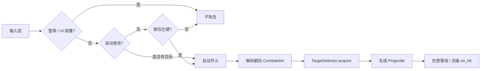
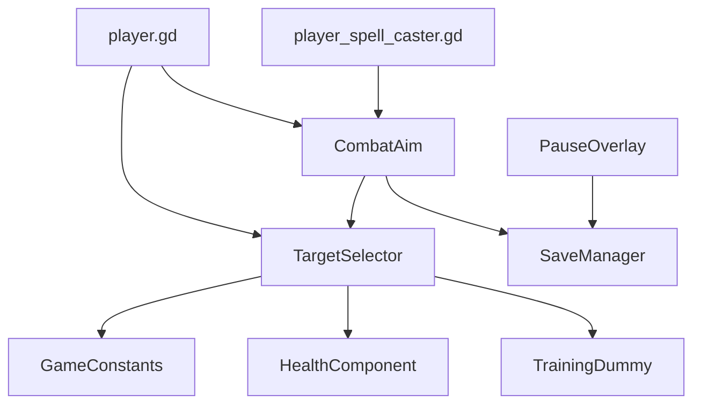

# 玩家攻击机制与索敌优先级

## 功能概述

**功能 ID**: `combat-targeting-priority`  
**创建日期**: 2026-06-10  
**最后更新**: 2026-06-10  
**状态**: active（v2 评分已实现）  
**对齐文档**: GDD v6.0 §4 基础操作；原型实现见 `game/README.md`

### 功能描述

本模块定义玩家在战斗中的**攻击触发方式**、**朝向解析**与**索敌目标选择**规则，覆盖：

- 鼠标左键普攻（弹道）
- Q/E/R 主动法术（蓄力 + 弹道/AOE）
- V 灵宠协同（方向性爆发）
- 可选辅助：自动瞄准、自动普攻

核心目标：在保留 GDD 手动操作的前提下，提供「只负责移动 + 放技能」的可选模式；索敌需兼顾**贴脸威胁、距离、残血收刀、Boss 加权**。

### 业务价值

- 降低 PC 操作负担，适配「怪物主动靠近」的战斗节奏
- 统一普攻/法术/灵宠的朝向来源，避免「打 A 瞄 B」
- 可数据化调参（距离圈、评分权重），便于 Boss 战与小怪潮平衡

---

## 攻击机制总览

### 输入与触发

| 攻击类型 | 键位 | 触发方式 | 冷却 | 朝向来源 |
|----------|------|----------|------|----------|
| 普攻 | 鼠标左键 | 按住连射（手动）或自动（开关） | `ATTACK_INTERVAL / attack_speed_mult`（默认 ≈0.35s） | `CombatAim` / `TargetSelector` |
| 法术 Q/E/R | Q / E / R | 按键一次，经 windup 后发射 | 各法术 `cooldown` | `CombatAim`（蓄力结束再解析一次） |
| 灵宠协同 | V | 按键一次 | 灵宠 `coord_cooldown` | `CombatAim` |
| 闪避 | 空格 | 位移 + 无敌帧 | `dodge_cooldown` | 移动方向（不参与索敌） |

### 攻击流水线（普攻 / 法术弹道）



### 与 GDD 的关系

| GDD 设定 | 本模块处理 |
|----------|------------|
| 鼠标左键普攻 | 默认手动；`auto_attack` 开启时改为自动连射 |
| 鼠标瞄准 | 默认；`auto_aim` 开启时改为索敌朝向 |
| 蓄力普攻（长按） | **未实现**；当前仅有连射，后续若加入需单独定义与自动模式互斥规则 |
| 灵宠 V + 方向 | 原型简化为 V + 自动/鼠标方向 |

---

## 辅助开关（玩家设置）

存储于 `SaveManager.profile`，Esc 暂停菜单配置，持久化到 `user://profile.json`。

| 存档键 | 界面文案 | 默认值 | 作用 |
|--------|----------|--------|------|
| `auto_aim` | 自动瞄准（法术/灵宠/普攻朝向） | `false` | 开启后朝向由 `TargetSelector` 决定，否则跟随鼠标 |
| `auto_attack` | 自动普攻（范围内自动连射，无需左键） | `false` | 开启后在攻击距离内有目标且 CD 就绪时自动发射普攻 |

### 组合行为矩阵

| auto_aim | auto_attack | 普攻 | 法术 Q/E/R | 灵宠 V |
|:--------:|:-----------:|------|------------|--------|
| ✓ | ✓ | 自动连射 + 索敌朝向 | 手动按键 + 索敌朝向 | 手动按键 + 索敌朝向 |
| ✓ | ✗ | 按住左键 + 索敌朝向 | 手动按键 + 索敌朝向 | 手动按键 + 索敌朝向 |
| ✗ | ✓ | 自动连射 + 索敌朝向* | 手动按键 + 鼠标朝向 | 手动按键 + 鼠标朝向 |
| ✗ | ✗ | 按住左键 + 鼠标朝向（GDD 默认） | 手动按键 + 鼠标朝向 | 手动按键 + 鼠标朝向 |

\* `auto_attack` 开启时，普攻朝向仍走索敌（即使 `auto_aim` 关闭），避免打 A 瞄 B。

### 旧存档迁移

若 profile 中存在旧键 `auto_target`，加载时一次性写入：

- `auto_aim` ← `auto_target`
- `auto_attack` ← `auto_target`

---

## 距离分档

三层距离圈，职责分离：

```text
          威胁圈              攻击圈                 瞄准圈
      ←── 140px ──→      ←── 480px ──→        ←── 520px ──→
           │                   │                      │
      贴脸优先判定          自动普攻可开火           自动瞄准可朝向
```

| 常量 | 值 | 说明 |
|------|-----|------|
| `threat_range` | **140** | 贴脸威胁圈；敌人进入此圈获得极高评分 |
| `auto_attack_range` | **480** | 自动普攻开火最大距离 |
| `auto_target_range` | **520** | 自动瞄准 / 索敌扫描最大距离 |
| `auto_target_stick_range` | **650** | 目标粘性：锁定目标在此范围内且仍存活时可保持 |

> 调参文件：`game/data/combat/targeting_config.csv`，运行时由 `TargetingConfig` 加载。

参考：`ENEMY_CONTACT_RANGE = 38`，`ENEMY_AGGRO_RANGE = 560`。威胁圈取 contact 与 aggro 之间的「近身压力区」。

### 分档行为

| 距离 | 自动普攻 | 自动瞄准 | 说明 |
|------|----------|----------|------|
| ≤ 140px | ✓（v2 贴脸优先） | ✓ | 小怪贴脸必须能打 |
| 140–480px | ✓ | ✓ | 主战斗区 |
| 480–520px | ✗ | ✓ | 只瞄不打 |
| > 520px | ✗ | ✗ | 回退到移动方向 / 鼠标 |

---

## 索敌优先级

### 实现状态

| 版本 | 状态 | 算法摘要 |
|------|------|----------|
| **v1** | 已废弃 | 类型优先：Boss > 精英 > 普通；同档取最近 |
| **v2（当前代码）** | **已实现** | 多因素评分：威胁圈 + 残血 + 距离 + 攻击圈内 Boss 加权 |

以下 v2 为当前实现算法。

---

### v2 评分公式（当前实现）

对每个候选敌人（存活、`enemy` 组、`dist ≤ max_range`）计算 `target_score`（**越高越优先**）。`max_range` 由调用方传入：`has_attack_target` 用 480，`direction_to_target` 用 520。

```
score = 0
dist  = 玩家到敌人距离
hp_ratio = current_hp / max_hp    # 来自 HealthComponent

# ① 威胁圈（贴脸必管）
if dist ≤ THREAT_RANGE:
    score += SCORE_THREAT_BASE                    # 默认 50_000
    score += (THREAT_RANGE - dist) × 80           # 越贴脸越高

# ② 攻击圈内
if dist ≤ AUTO_ATTACK_RANGE:
    score += SCORE_ATTACK_RANGE_BASE              # 默认 5_000
    if is_boss:  score += SCORE_BOSS_IN_ATTACK    # 默认 3_000
    elif is_elite: score += SCORE_ELITE_IN_ATTACK # 默认 800

# ③ 残血收刀
score += (1.0 - hp_ratio) × SCORE_LOW_HP_MAX      # 默认 2_500

# ④ 距离近优（随 acquire 的 scan 半径归一化，480 或 520）
score += (1.0 - dist / max_range) × SCORE_DISTANCE_MAX  # 边缘敌人得 0 分
```

#### v2 推荐常量（`game_constants.gd`）

| 常量 | 建议值 | 说明 |
|------|--------|------|
| `THREAT_RANGE` | 140.0 | 威胁圈半径 |
| `SCORE_THREAT_BASE` | 50000.0 | 威胁圈基础分 |
| `SCORE_THREAT_CLOSE_BONUS` | 80.0 | 威胁圈内贴脸加成系数 |
| `SCORE_ATTACK_RANGE_BASE` | 5000.0 | 进入攻击圈加分 |
| `SCORE_BOSS_IN_ATTACK` | 3000.0 | Boss 在攻击圈内额外加分 |
| `SCORE_ELITE_IN_ATTACK` | 800.0 | 精英在攻击圈内额外加分 |
| `SCORE_LOW_HP_MAX` | 2500.0 | 残血满分加成 |
| `SCORE_DISTANCE_MAX` | 1500.0 | 距离满分加成 |
| `STICK_SWITCH_RATIO` | 1.15 | 粘性切换：新目标需高 15% 才换 |
| `STICK_BOSS_SWITCH_RATIO` | 1.05 | Boss 进入攻击圈时略宽松 |

---

### v2 典型场景验收

| # | 场景 | 预期目标 | 依据 |
|---|------|----------|------|
| 1 | Boss 400px，小怪 100px 贴脸 | **小怪** | 威胁圈 50k+ |
| 2 | Boss 200px，小怪 350px 满血 | **Boss** | 更近 + Boss 攻击圈加分 |
| 3 | 两小怪：150px 满血 vs 280px 15% 血 | **150px**（默认） | 距离权重；提高 `SCORE_LOW_HP_MAX` 可改为收残血 |
| 4 | Boss 150px，精英 120px 残血 | **更贴脸且更残者** | 威胁圈 + 残血 + 距离综合 |
| 5 | 所有敌人 > 480px | **不自动普攻** | 攻击圈外不开火 |
| 6 | 目标 500px | **可瞄准，不普攻** | 瞄准圈 / 攻击圈分离 |

---

### 目标粘性与切换规则（v2）

防止多怪环境下目标每帧乱跳：

```
locked = 当前 WeakRef 锁定目标
best   = 评分最高候选

若 locked 存活且在 STICK_RANGE 内，且 locked 仍在当前 max_range 内：
    若 best.score > locked.score × STICK_SWITCH_RATIO：
        切换 best
    否则：
        保持 locked
否则：
    锁定 best（或清空）

# 即时切换例外（不等 15% 迟滞）
若存在敌人进入 THREAT_RANGE，且 locked 不在 THREAT_RANGE：
    立即切换至 THREAT_RANGE 内最高分敌人

若 Boss 进入 AUTO_ATTACK_RANGE，locked 为小怪且 locked 不在 THREAT_RANGE：
    若 boss.score > locked.score × STICK_BOSS_SWITCH_RATIO：
        切换 Boss
```

---

### v1 历史记录（已废弃，仅供参考）

> v2 已完全替换下列逻辑；本节仅保留变更背景，**不代表当前代码**。

```text
priority: Boss=2, Elite=1, Normal=0
同 priority → distance_squared 最小
粘性：STICK_RANGE 内保持；仅当更高 priority 类型出现时打断
```

**v1 局限**（v2 已解决）：

- 不区分残血；满血近怪与残血远怪同等对待（除距离 tie-break）
- Boss 在同档内绝对优先，贴脸小怪可能被忽略（v1 已部分用「粘性 + 高 priority 打断」缓解，但无威胁圈）
- 无评分迟滞，仅有类型打断

---

## 朝向解析（CombatAim）

### 决策树

```
resolve_direction(player, move_hint):

  if auto_aim:
      return TargetSelector.direction_to_target(player, move_hint)

  to_mouse = mouse - player
  if |to_mouse| > ε:
      return normalize(to_mouse)

  return normalize(move_hint) or last_facing or RIGHT
```

### 普攻专用（player.gd）

```
_resolve_basic_attack_direction:

  if auto_aim OR auto_attack:
      return TargetSelector.direction_to_target(...)

  else:
      鼠标 → move_hint → last_facing
```

### 移动 hint（`get_aim_move_hint`）

无索敌目标时的回退朝向，优先级：

1. 当前 WASD 输入方向  
2. `velocity` 方向  
3. `_last_facing`（最近一次非零移动输入）

**设计意图**：站立不动时怪物靠近，仍可用最后朝向或索敌目标；不强制「必须移动才攻击」。

---

## 代码结构

### 文件清单

```
game/
├── core/constants/game_constants.gd     # 距离圈、攻速、弹道常量
├── core/utils/variant_utils.gd        # 存档布尔解析
├── systems/combat/
│   ├── combat_aim.gd                    # 朝向解析（auto_aim / 鼠标）
│   ├── target_selector.gd               # 索敌选目标、粘性、has_attack_target
│   ├── player_spell_caster.gd           # Q/E/R 蓄力与发射
│   └── health_component.gd              # is_alive()，供候选过滤
├── scenes/player/player.gd              # 移动、闪避、普攻、灵宠 V
├── scenes/enemies/training_dummy.gd     # is_boss_unit() / is_elite_unit()
├── scenes/ui/pause_overlay.gd         # 两开关 UI
└── autoload/save_manager.gd             # auto_aim / auto_attack 持久化
```

### 依赖关系



---

## 关键方法（含逻辑）

### TargetSelector.acquire(player, max_range) → Node2D

- **做什么**：在指定半径内选出唯一索敌目标。
- **步骤**：
  1. 若锁定目标在 `STICK_RANGE` 内且仍在 `max_range` 内 → 检查威胁/Boss 即时切换，或更高 score（需超 `STICK_SWITCH_RATIO`）；
  2. 否则扫描 `enemy` 组，过滤死亡/超距；
  3. 更新 `_locked` WeakRef，返回目标或 `null`。
- **边界**：玩家或 SceneTree 为空 → `null`；无敌人 → 清空锁定。

### TargetSelector.has_attack_target(player) → bool

- **做什么**：是否存在可在普攻距离内开火的目标。
- **实现**：`acquire(player, AUTO_ATTACK_RANGE) != null`。
- **注意**：必须使用攻击圈半径，不能用瞄准圈，否则超距误开火。

### TargetSelector.score_enemy(player, enemy, score_range) → float

- **做什么**：计算单个敌人的索敌评分。
- **score_range**：距离项归一化分母，与 `acquire(max_range)` 传入值一致（480 或 520）；边缘敌人得 0 距离分。
- **步骤**：威胁圈加分 → 攻击圈 Boss/精英加分 → 残血加分 → 距离加分。

### TargetSelector.direction_to_target(player, move_hint) → Vector2

- **做什么**：返回指向当前目标的单位向量；无目标则回退 `move_hint` / `RIGHT`。

### CombatAim.resolve_direction(player, move_hint) → Vector2

- **做什么**：统一法术/灵宠朝向；仅受 `auto_aim` 控制。

### player._physics_process

- **自动普攻**：`auto_attack && cd<=0 && has_attack_target` → `_fire_basic_attack`（无需左键）。
- **手动普攻**：`Input.is_action_pressed("attack")`。
- **暂停 / UI 阻塞**：`get_tree().paused` 或 `RunContext.ui_blocking` 时整帧 return。

### player_spell_caster._fire_spell

- **蓄力结束**时再次 `CombatAim.resolve_direction`，避免 windup 期间目标移动导致打空。

---

## 敌人侧接口约定

索敌依赖敌人节点满足：

| 要求 | 说明 |
|------|------|
| `add_to_group("enemy")` | 进入扫描池 |
| 子节点 `HealthComponent` | `is_alive()` 过滤死亡 |
| `is_boss_unit() -> bool` | Boss 加权（`training_dummy` 已实现） |
| `is_elite_unit() -> bool` | 精英加权（`training_dummy` 已实现） |
| 死亡时 `remove_from_group("enemy")` | 避免锁尸体 |

新增敌人类型必须实现上述接口，否则按普通怪处理。

---

## 使用指南（玩家）

### 功能入口

战斗中按 **Esc** → 暂停面板 → 勾选：

- **自动瞄准（法术/灵宠/普攻朝向）**
- **自动普攻（范围内自动连射，无需左键）**

### 推荐组合

| 玩家诉求 | 建议设置 |
|----------|----------|
| 全手动（GDD 默认） | 两者均关 |
| 只不想瞄鼠标，仍想控普攻节奏 | 只开自动瞄准 |
| 只移动 + 放技能，普攻也省心 | 两者均开 |

### 注意事项

- 自动普攻仅在 **480px 内**有敌人时开火；远处只会瞄不会打。
- 清房后自动停火；无需手动关开关。
- 法术 **不会**自动释放，仍需按 Q/E/R。
- 移动端后续可默认开启两开关（待平台适配）。

---

## 测试清单

### 开关与触发

- [ ] 两开关独立；四种组合行为符合矩阵
- [ ] 站立不动，怪进入 480px，自动普攻开火
- [ ] 怪在 500px：瞄准但不自动普攻
- [ ] 暂停 / 选机缘时不自动攻击

### 优先级（v2 实现后）

- [ ] 贴脸小怪 vs 远处 Boss → 打小怪
- [ ] 无贴脸威胁 → 攻击圈内 Boss 优于同距小怪
- [ ] 同距两小怪 → 残血者优先（调参后）
- [ ] 目标切换无高频抖动

### 朝向

- [ ] 自动普攻开启、自动瞄准关闭 → 弹道仍指向索敌目标
- [ ] 法术 windup 结束后朝向当前目标
- [ ] 无敌人 → 回退移动方向 / 最后朝向

---

## 实现路线图

| 阶段 | 内容 | 状态 |
|------|------|------|
| Phase 0 | 两开关、CombatAim、TargetSelector v1、自动普攻 | ✅ 已完成 |
| Phase 1 | v2 评分公式替换 `_find_best`；新增 THREAT / SCORE 常量 | ✅ 已完成 |
| Phase 2 | 粘性迟滞 + 威胁/Boss 即时切换 | ✅ 已完成 |
| Phase 3 | 锁定 UI、Boss 战 CSV 权重表（可选） | 规划中 |

---

## 变更历史

| 日期 | 版本 | 变更内容 |
|------|------|----------|
| 2026-06-10 | v1.3 | 文档对齐实现日志；实现状态见 [`implementation-log.md`](../implementation-log.md) |
| 2026-06-10 | v1.2 | 距离评分随 acquire 的 max_range 归一化；v1 章节改为历史记录 |
| 2026-06-10 | v1.1 | 实现 v2 评分索敌、威胁圈/Boss 切换、GameConstants 权重常量 |
| 2026-06-10 | v1.0 | 初版：攻击机制、双开关、距离分档、v1/v2 索敌方案、代码映射 |
| 2026-06-10 | — | 原型实现：auto_aim / auto_attack、TargetSelector v1、粘性修复 |

---

## 相关文档

- [GDD v6.0 §4 基础操作](../GDD_轮回仙途_v6.0.md)
- [UI/UX 规范 v1.0](../UIUX_轮回仙途_v1.0.md)
- [实现日志](../implementation-log.md) — 索敌 / RNG 等近期变更汇总
- [game/README.md](../../game/README.md) — 原型实现状态
